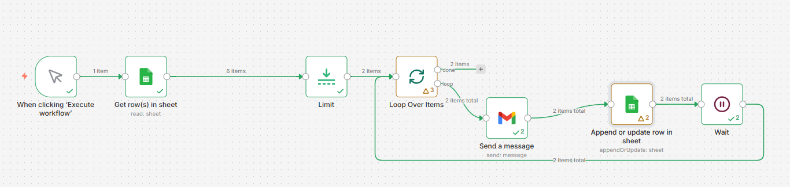

# 📧 Automated Daily Email Sender with n8n

This project is an **n8n workflow automation** that sends a fixed number of emails daily from a Google Sheet and updates the status automatically.

---

## 🚀 Features

* ✅ Sends **2 emails per day automatically**
* ✅ Reads data from Google Sheets
* ✅ Skips already sent emails
* ✅ Updates status after sending:

  * Email Sent → Yes
  * Sent Date
  * Sent Time
* ✅ Prevents duplicate sending
* ✅ Fully automated with scheduling (Cron)

---

## 🧠 Workflow Logic

1. Fetch all rows from Google Sheet
2. Filter rows where `Email Sent?` is not "Yes"
3. Select only **2 rows per execution**
4. Loop through selected rows
5. Send email using Gmail node
6. Update the same row with:

   * Email Sent = Yes
   * Sent Date
   * Sent Time

---

## 🔄 Workflow Structure

```text
Cron (Daily Trigger)
   ↓
Google Sheets (Get Rows)
   ↓
Filter (Email Sent != Yes)
   ↓
Limit (2)
   ↓
Loop Over Items
   ↓
Send Email (Gmail)
   ↓
Update Row (Mark as Sent)
```

---

## 📊 Google Sheet Format

| Name | Gmail                                   | Sent Date  | Sent Time | Email Sent? |
| ---- | --------------------------------------- | ---------- | --------- | ----------- |
| John | [john@gmail.com](mailto:john@gmail.com) | 2026-04-24 | 11:48 AM  | Yes         |

---

## ⚙️ Setup Instructions

### 1. Clone the repo

```bash
git clone [https://github.com/your-username/your-repo-name.git](https://github.com/rjriyad3077-beep/Automated-Daily-Email-Sender-with-n8n.git)
```

### 2. Import workflow into n8n

* Open n8n
* Go to **Workflows**
* Click **Import**
* Paste the JSON file

### 3. Connect credentials

* Google Sheets API
* Gmail account

### 4. Configure Cron

* Set your preferred time (e.g., daily at 9 AM)

---

## 📌 Requirements

* n8n (self-hosted or cloud)
* Google account (Sheets + Gmail access)

---

## 💡 Use Cases

* Email campaigns
* Lead follow-ups
* Notifications
* Bulk email scheduling

---

## 🛡️ Notes

* Ensure column names match exactly
* Use consistent date format (YYYY-MM-DD recommended)
* Avoid manual edits during execution

---

## 📜 License

MIT License

---

## 🙌 Author

Built with ❤️ using n8n
## 📸 Workflow Screenshot


